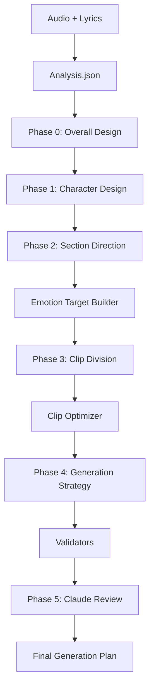

# MV Orchestra v2.8

**Multi-Director AI Competition System for Music Video Generation**

MV Orchestra is a sophisticated AI-powered system that orchestrates multiple "AI directors" to compete in designing comprehensive music video concepts. Through a multi-phase competition, five distinct director personas evaluate and propose ideas, with the best concepts advancing through each phase.

[](https://github.com/yourrepo/mv-orchestra)
[](https://www.python.org/)
[](LICENSE)

---

## Table of Contents

- [Overview](#overview)
- [Features](#features)
- [Quick Start](#quick-start)
- [Installation](#installation)
- [Usage](#usage)
- [Architecture](#architecture)
- [Documentation](#documentation)
- [Examples](#examples)
- [Contributing](#contributing)
- [License](#license)

---

## Overview

MV Orchestra transforms music video production planning into a competitive creative process. Five AI directors, each with unique personalities and expertise, compete across six phases:

```
Phase 0: Overall Design      → Conceptual direction and themes
Phase 1: Character Design     → Character concepts and development
Phase 2: Section Direction    → Per-section creative direction
Phase 3: Clip Division        → Shot-by-shot breakdown
Phase 4: Generation Strategy  → Technical generation parameters
Phase 5: Claude Review        → Final quality control (optional)
```

Each phase builds upon the previous winners' concepts, creating a refined, cohesive music video design.

---

## Features

### Core Capabilities

- **Multi-Director Competition**: Five distinct AI directors with unique personalities
  - Corporate Professional (田中健一): Safe, commercial-focused
  - Freelancer Creative (佐藤美咲): Innovative, risk-taking
  - Veteran Expert (鈴木太郎): Experienced, balanced
  - Award Winner (高橋愛): Artistic, boundary-pushing
  - Talented Newcomer (山田花子): Fresh, experimental

- **Six-Phase Pipeline**:
  - Automated progression from concept to execution
  - Beat-accurate clip timing
  - Emotion-driven section direction
  - Technical generation strategies

- **Audio Analysis Tools**:
  - BPM detection
  - Beat tracking
  - Section detection
  - Mood analysis
  - Lyrics alignment (optional)

- **Optimization Tools**:
  - Emotion target builder
  - Clip optimizer
  - Beat alignment

- **Validation Tools**:
  - Clip division validation
  - Strategy validation
  - Coverage analysis

### Output Format

Complete generation plan including:
- Clip-by-clip breakdown with precise timing
- Character designs and consistency guides
- Visual style specifications
- Prompt templates for AI video generators
- Technical parameters (model selection, settings)
- Asset management plan

---

## Quick Start

### Prerequisites

- Python 3.9 or higher
- (Optional) ffmpeg for audio analysis
- (Optional) Anthropic API key for real evaluations

### Basic Usage

```bash
# 1. Clone the repository
git clone https://github.com/yourrepo/mv-orchestra.git
cd mv-orchestra

# 2. Run with sample data
python3 run_all_phases.py my_first_session

# 3. Check results
ls -la shared-workspace/sessions/my_first_session/
```

That's it! The pipeline will run with mock evaluations using the included sample analysis.

---

## Installation

### Standard Installation

```bash
# Clone repository
git clone https://github.com/yourrepo/mv-orchestra.git
cd mv-orchestra

# No dependencies required for basic usage!
# The core system runs with Python standard library only
```

### Optional: Audio Analysis

To analyze your own MP3 files:

```bash
pip install librosa scipy numpy
```

### Optional: Real AI Evaluations

To use actual Claude API instead of mock evaluations:

```bash
# Install the Anthropic SDK
pip install anthropic

# Set your API key
export ANTHROPIC_API_KEY="your-api-key"
```

**Get your API key**: https://console.anthropic.com/

For detailed installation instructions, see [INSTALL.md](INSTALL.md).

---

## Usage

### Command-Line Interface

```bash
# Basic usage with sample data
python3 run_all_phases.py my_session

# Use your own audio and lyrics
python3 run_all_phases.py my_session --audio song.mp3 --lyrics song.txt --rebuild-analysis

# Use existing analysis
python3 run_all_phases.py my_session --analysis my_analysis.json

# Enable validation
python3 run_all_phases.py my_session --validate

# Use real Claude API (requires API key)
python3 run_all_phases.py my_session --real-mode

# Run with Phase 5 review
python3 run_all_phases.py my_session --phase5-mode real
```

### Programmatic Usage

```python
from core import SharedState
from phase0 import run_phase0
from phase1 import run_phase1
# ... import other phases

# Create session
session_id = "my_project"
session = SharedState.create_session(session_id)

# Run phases
phase0_results = run_phase0(session_id, "analysis.json", mock_mode=True)
phase1_results = run_phase1(session_id, mock_mode=True)
# ... continue for other phases

# Access results
session = SharedState.load_session(session_id)
winner_concept = session.get_phase_data(0)['winner']
```

For more usage examples, see:
- [USER_GUIDE.md](USER_GUIDE.md) - Complete user guide
- [examples/](examples/) - Code examples

---

## Using Real AI Evaluations

By default, MV Orchestra uses **mock evaluations** (no API costs, perfect for learning and development). To use real Claude AI evaluations:

### Setup

1. **Install anthropic package**
   ```bash
   pip install anthropic
   ```

2. **Get API key**
   - Sign up at https://console.anthropic.com/
   - Generate an API key
   - Set environment variable:
     ```bash
     export ANTHROPIC_API_KEY="your-key-here"
     ```

3. **Run in real mode**
   ```bash
   python3 run_all_phases.py my_project --real-mode
   ```

### Testing Real AI

Test with a single evaluation:
```bash
python3 test_real_ai.py
```

Test with all 5 directors:
```bash
python3 test_real_ai.py --all
```

### Cost Estimates

- **Single evaluation**: ~$0.01-0.05
- **Complete session** (Phases 0-4): ~$0.50-2.00
  - 5 directors × 5 phases = 25 evaluations
  - Cost varies based on proposal complexity
- **Phase 5 review** (optional): +$0.50

**Tips to minimize costs:**
- Use mock mode for development and testing
- Use real mode only for final production runs
- Start with `test_real_ai.py` to verify setup
- Monitor API usage in Anthropic console

### How It Works

Real AI mode:
1. Loads director-specific evaluation criteria from `.claude/prompts_v2/evaluation_*.md`
2. Formats prompts with proposal context
3. Calls Claude API (claude-sonnet-4-5 model)
4. Parses JSON responses with scores, feedback, and suggestions
5. Falls back to mock mode on any errors

The system uses 30 expert prompts (5 directors × 6 phases) to ensure authentic, personality-driven evaluations.

### Troubleshooting

**"ANTHROPIC_API_KEY not set"**
- Make sure you exported the environment variable
- Check: `echo $ANTHROPIC_API_KEY`

**"anthropic package not installed"**
- Run: `pip install anthropic`
- Verify: `python3 -c "import anthropic; print(anthropic.__version__)"`

**API errors**
- Check API key is valid at https://console.anthropic.com/
- Verify you have credits/billing set up
- System automatically falls back to mock mode on errors

---

## Architecture

### Directory Structure

```
mv-orchestra/
├── core/                    # Core framework
│   ├── shared_state.py      # Session management
│   ├── director_profiles.py # Director personalities
│   ├── codex_runner.py      # Evaluation engine
│   └── utils.py             # Utilities
├── phase0/                  # Phase 0: Overall Design
├── phase1/                  # Phase 1: Character Design
├── phase2/                  # Phase 2: Section Direction
├── phase3/                  # Phase 3: Clip Division
├── phase4/                  # Phase 4: Generation Strategy
├── phase5/                  # Phase 5: Claude Review
├── tools/                   # Optimization & validation
│   ├── optimization/        # Optimization tools
│   └── validators/          # Validation tools
├── examples/                # Usage examples
├── shared-workspace/        # Data directory
│   ├── input/               # Input files
│   └── sessions/            # Session data
├── run_all_phases.py        # Main pipeline script
└── test_e2e.py              # End-to-end tests
```

### Phase Flow



---

## Documentation

- **[USER_GUIDE.md](USER_GUIDE.md)** - Complete usage guide
- **[INSTALL.md](INSTALL.md)** - Installation instructions
- **[DEVELOPER_GUIDE.md](DEVELOPER_GUIDE.md)** - Development guide
- **[API_REFERENCE.md](API_REFERENCE.md)** - API documentation
- **[CHANGELOG.md](CHANGELOG.md)** - Version history

### Phase-Specific Documentation

- Phase 0-5: See individual phase directories for detailed documentation
- Tools: See `tools/optimization/README.md` and `tools/validators/README.md`

---

## Examples

### Example 1: Basic Pipeline

```python
# Run complete pipeline with defaults
python3 examples/example_basic.py
```

### Example 2: Custom Directors

```python
# Explore and work with director profiles
python3 examples/example_custom_directors.py
```

### Example 3: Programmatic Control

```python
# Full programmatic control over pipeline
python3 examples/example_programmatic.py
```

### Example 4: Audio Analysis Only

```python
# Just analyze audio without running pipeline
python3 examples/example_analysis_only.py your_song.mp3
```

---

## Testing

### Run End-to-End Tests

```bash
# Run all tests
python3 test_e2e.py

# Verbose mode
python3 test_e2e.py -v

# Run specific test
python3 -m unittest test_e2e.TestE2EPipeline.test_full_pipeline_mock_mode
```

### Run Component Tests

```bash
# Test individual phases
python3 phase0/test_phase0.py
python3 phase1/test_phase1.py
# ... etc

# Test tools
python3 tools/optimization/run_tests.py
python3 tools/validators/test_validate_clip_division.py
```

---

## Performance

- **Mock Mode**: Completes full pipeline in ~5-10 seconds
- **Real Mode**: Depends on API response times (~30-60 seconds per phase)
- **Memory Usage**: ~50-100MB for typical sessions
- **Storage**: ~1-5MB per session

---

## Roadmap

### Current Version (v2.8)

- ✅ Complete 6-phase pipeline
- ✅ 5 director profiles with 30 prompts
- ✅ Audio analysis tools
- ✅ Optimization tools
- ✅ Validation tools
- ✅ End-to-end tests
- ✅ Comprehensive documentation

### Future Enhancements

- 🔲 Real-time progress visualization
- 🔲 Web interface
- 🔲 Video generation integration
- 🔲 Advanced audio features (melody, harmony analysis)
- 🔲 Multi-language support
- 🔲 Collaborative editing
- 🔲 Template library

---

## Contributing

We welcome contributions! Please see:

1. Fork the repository
2. Create a feature branch (`git checkout -b feature/amazing-feature`)
3. Commit your changes (`git commit -m 'Add amazing feature'`)
4. Push to the branch (`git push origin feature/amazing-feature`)
5. Open a Pull Request

### Development Setup

```bash
# Clone repository
git clone https://github.com/yourrepo/mv-orchestra.git
cd mv-orchestra

# Install development dependencies (optional)
pip install pytest black flake8 mypy

# Run tests
python3 test_e2e.py

# Run linting
black .
flake8 .
```

---

## License

This project is licensed under the MIT License - see the [LICENSE](LICENSE) file for details.

---

## Acknowledgments

- Inspired by real music video production workflows
- Built with Claude AI assistance
- Special thanks to all contributors

---

## Support

- **Issues**: [GitHub Issues](https://github.com/yourrepo/mv-orchestra/issues)
- **Discussions**: [GitHub Discussions](https://github.com/yourrepo/mv-orchestra/discussions)
- **Email**: support@example.com

---

## Citation

If you use MV Orchestra in your research or project, please cite:

```bibtex
@software{mv_orchestra_2025,
  title = {MV Orchestra: Multi-Director AI Competition System},
  author = {Your Name},
  year = {2025},
  version = {2.8},
  url = {https://github.com/yourrepo/mv-orchestra}
}
```

---

**Made with ❤️ by the MV Orchestra Team**

*Last Updated: 2025-11-14*
